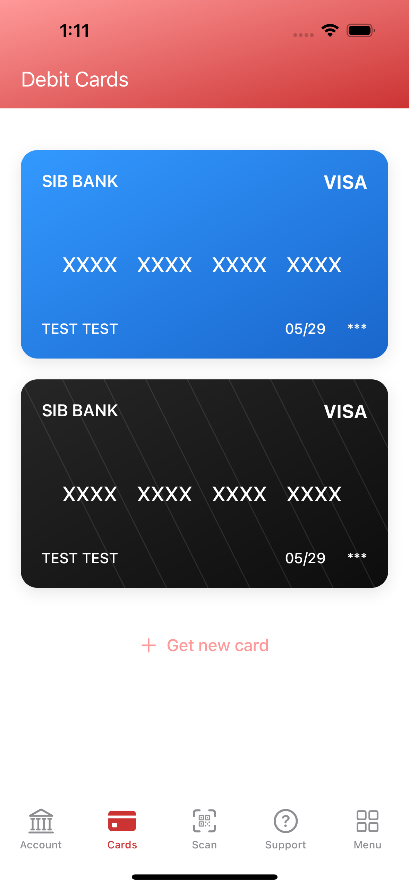
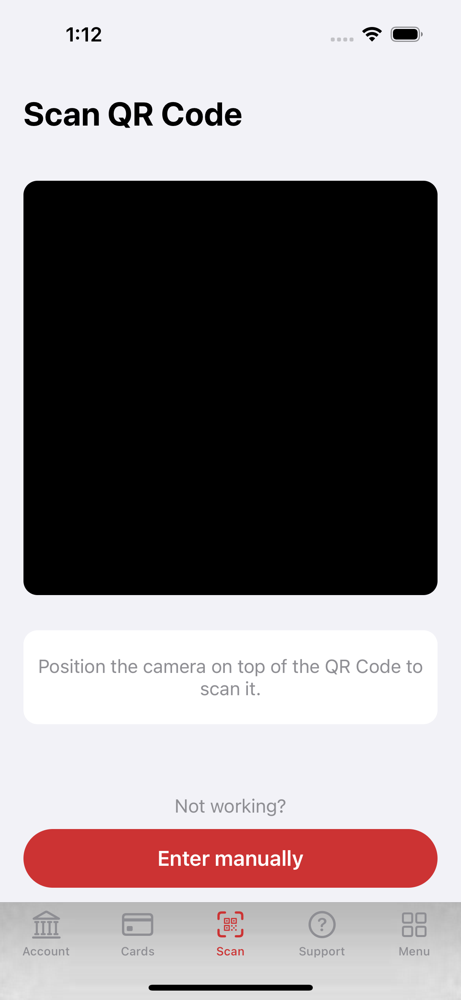
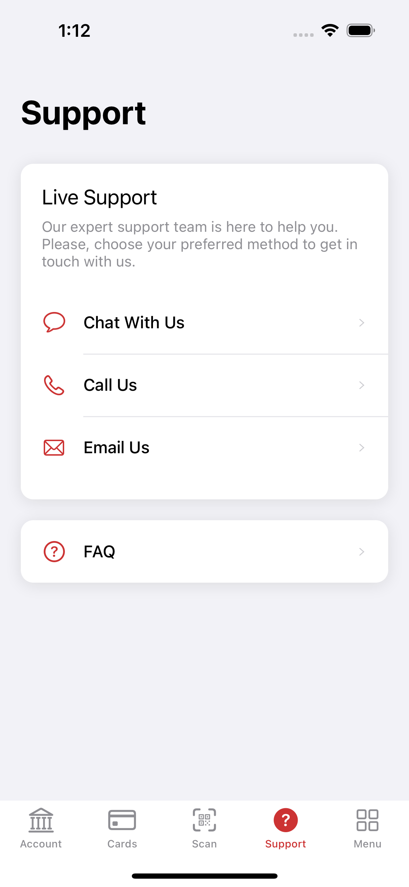
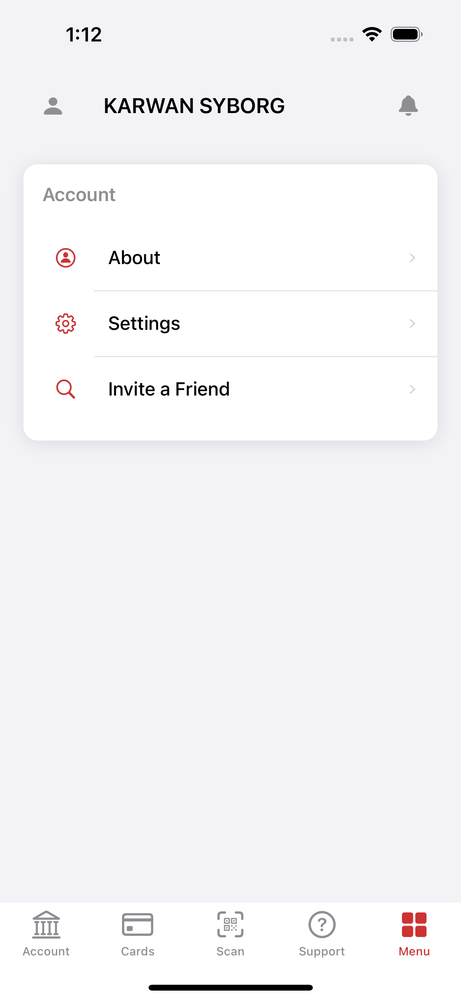

# SIB (Second Iraqi Bank) 🏦

A modern iOS banking app clone built programmatically with UIKit, inspired by FIB (First Iraqi Bank).

## ✨ Features
- 🏠 **Account Dashboard** - Balance overview and quick actions
- 💳 **Card Management** - Beautiful gradient debit cards display
- 📱 **QR Scanner** - Camera-based QR code scanning
- 💬 **Support Center** - Live support and help options
- ⚙️ **Menu** - Account settings and preferences

## 📱 Screenshots

| Account | Cards | Scanner | Support | Menu |
|:-------:|:-----:|:-------:|:-------:|:----:|
|  |  |  |  |  |
| Balance display with transaction history and banking actions | Debit card collection with gradient designs | QR code scanning interface with manual entry option | Live support options with chat, call, and email | User account settings and app preferences |

## 🛠️ Tech Stack
- **Language:** Swift
- **UI Framework:** UIKit (Programmatic - No Storyboard)
- **Camera:** AVFoundation
- **Architecture:** MVVM Pattern
- **Platform:** iOS Native

## 🚀 Getting Started
```bash
git clone https://github.com/yourusername/SIB_Clone.git
cd SIB_Clone
open SIB_Clone.xcodeproj
```

## 📝 Note
This is a UI-only implementation focusing on design and layout. Banking functionality is not implemented.

---
**Made with ❤️ for iOS banking experience**
