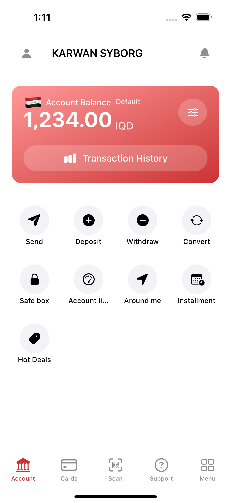

# FIB Clone 🏦
<p align="center">
  
</p>

## 💳 What is FIB Clone?  
**FIB Clone** is a modern **banking app clone** built with native iOS technology.  
Experience seamless digital banking with a beautiful, intuitive interface.  
- Manage your **bank cards** with stunning gradient designs 💳  
- **QR Code scanning** for quick payments and transactions 📱  
- **Account overview** with balance tracking and transaction history 📊  
- **Digital wallet** functionality with secure card storage 🔒  
- **Support center** with comprehensive help and assistance 💬  
All crafted with **SwiftUI** and **UIKit** for optimal performance and user experience.  

---

## 🔥 Features  
- 💳 **Card Management** → Beautiful gradient card designs with secure storage and easy access.  
- 📱 **QR Scanner** → Advanced camera-based QR code scanning for payments and transfers.  
- 🏠 **Account Dashboard** → Complete account overview with balance, transactions, and quick actions.  
- 📞 **Support Center** → Comprehensive help system with FAQs and customer support.  
- 🎨 **Modern UI/UX** → Clean, intuitive design following iOS design guidelines.  
- 🌙 **Dark/Light Mode** → Full support for iOS system appearance preferences.  

---

## 📷 Screenshots

| **Card Management** | **QR Scanner** | **Account Overview** | **Support Center** | **App Navigation** |
|:-------------------:|:--------------:|:-------------------:|:------------------:|:------------------:|
|  |  |  |  |  |
| **Elegant card display with gradient backgrounds and secure card details management** | **Advanced QR code scanning with real-time camera preview and manual entry option** | **Comprehensive account dashboard showing balance, recent transactions, and quick actions** | **Complete support system with help articles, contact options, and FAQ section** | **Intuitive bottom navigation with smooth transitions between main app sections** |

### 🎯 App Flow Overview
- **Card Experience**: Securely store and manage multiple bank cards with beautiful visual design
- **Payment Solutions**: Quick QR code scanning for seamless payment processing
- **Account Management**: Complete financial overview with transaction history and balance tracking
- **Customer Support**: Integrated help system with multiple support channels
- **Secure Banking**: Built with security best practices and data protection

---

## 🛠️ Tech Stack  
- **Language:** Swift  
- **Frameworks:** SwiftUI, UIKit  
- **Camera:** AVFoundation (QR Scanner)  
- **Architecture:** MVVM Pattern  
- **Platform:** iOS (Native)  

---

## 🚀 Getting Started
1. Clone this repository
   ```bash
   git clone https://github.com/yourusername/FIB_Clone.git
   ```
2. Open `FIB_Clone.xcodeproj` in Xcode
3. Build and run on iOS simulator or device
4. Ensure camera permissions are granted for QR scanning functionality

---

## 📱 App Structure
```
FIB_Clone/
├── Model/
│   ├── Card.swift              # Card data model
│   └── ActionItem.swift        # Action items model
├── View/
│   ├── MainViews/
│   │   ├── CardsViewController.swift    # Card management screen
│   │   ├── ScanViewController.swift     # QR scanner screen
│   │   ├── AccountViewController.swift  # Account overview screen
│   │   ├── SupportViewController.swift  # Support center screen
│   │   └── MenuViewController.swift     # Menu screen
│   ├── ViewModel/              # ViewModels for MVVM architecture
│   ├── ContentView.swift       # Main app entry point
│   ├── BottomNavigation.swift   # Bottom tab navigation
│   ├── HeaderView.swift         # Reusable header component
│   └── QRScannerCameraManager.swift # Camera management for QR scanning
└── Assets.xcassets/            # App assets and images
```

---

## 🔧 Key Components
- **Card Management**: Secure storage and display of bank cards with gradient designs
- **QR Scanner**: Real-time camera scanning with AVFoundation
- **MVVM Architecture**: Clean separation of concerns with ViewModels
- **Custom UI Components**: Reusable header views and navigation components
- **Responsive Design**: Optimized for various iOS device sizes

---

## 🤝 Contributing
Feel free to contribute to this project! Whether it's:
- 🐛 Bug fixes
- ✨ New features  
- 📖 Documentation improvements
- 🎨 UI/UX enhancements
- 🔒 Security improvements

<p align="center">
  <b>Made with ❤️ for modern digital banking experience on iOS</b>
</p> 